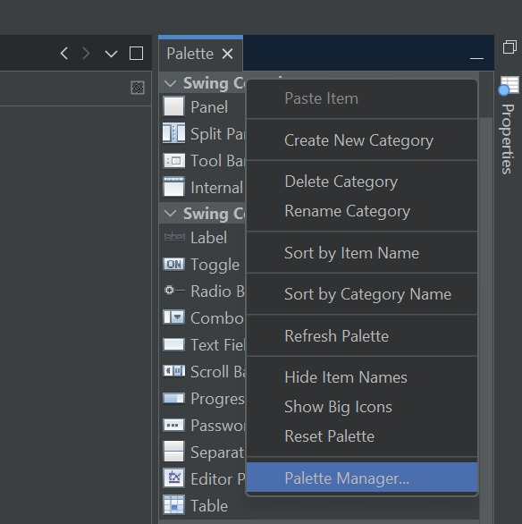
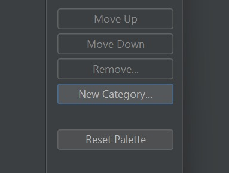
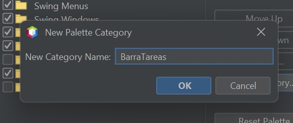
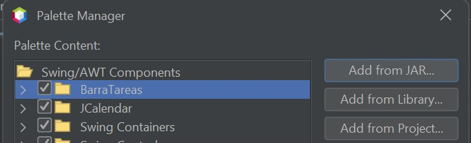
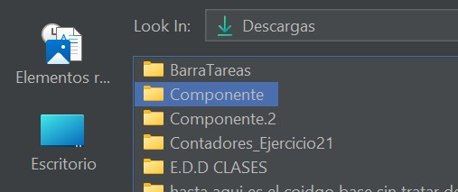
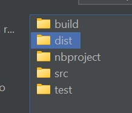
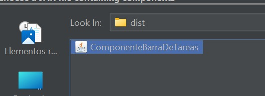

# Proyecto-Componente-Visual
Componente "Barra de Herramientas"

Barra de Tareas Personalizada para NetBeans
----------------------

Si estás buscando una barra de tareas elegante y funcional para tus actividades, esta barra le dará vida a tusprogramas. 

Instalacion en netbeans
----------------------
1. Compila el proyecto para generar el archivo JAR del componente
2. En NetBeans, ve a Herramientas > Paleta > Swing/AWT Components
3. Haz clic en "Add from JAR..."
4. Selecciona el archivo JAR generado
5. En la lista de componentes, selecciona "CodigoBarra"
6. Elige la categoría donde quieres colocarlo (ej. "Swing Controls")
7. Haz clic en "Finish"

El componente aparecerá ahora en tu paleta de NetBeans y podrás arrastrarlo a tus formularios como cualquier otro componente Swing.

Uso
---------
1. Arrastra el componente desde la paleta a tu formulario
2. Por defecto aparecerá en la parte inferior (SOUTH)
3. Personaliza las propiedades desde el inspector de propiedades:
   - barraAnclada: true/false para activar auto-ocultación
   - posicion: SOUTH (abajo), WEST (izquierda), EAST (derecha)
   - mostrarWifi/mostrarBateria/mostrarReloj: controla visibilidad

Imagina tener esto en tus apps:
- **Reloj siempre puntual** 
- **WiFi monitor** 
- **Batería** 
- **Botones útiles** (WhatsApp y Calculadora)
- **Botones reutilizables**

##  Configuración a Tu Gusto
 Monitor de WiFi:
   - Muestra icono con intensidad de señal
   - Actualización automática cada 30 segundos
   - Tooltip con porcentaje exacto

 Monitor de Batería:
   - Muestra nivel de carga (Windows)
   - Icono cambia según porcentaje
   - Indica si está cargando
   - Actualización cada minuto

 Reloj Digital:
   - Formato HH:mm:ss
   - Actualización en tiempo real

 Cronómetro:
   - Inicio/parada con el botón
   - Muestra horas:minutos:segundos
   - Visualización en la barra

 Accesos rápidos:
   - WhatsApp Web: abre en navegador predeterminado
   - Calculadora: abre calculadora web
   - URLs configurables mediante propiedades

 Personalización:
   - Menú contextual con clic derecho
   - Posición configurable
   - Visibilidad de elementos
   - Modo auto-ocultable

Propiedades Configurables
------------------------
 - barraAnclada: true/false - controla si la barra se auto-oculta
 - posicion: SOUTH/WEST/EAST - posición en el contenedor
 - mostrarWifi: true/false - visibilidad icono WiFi
 - mostrarBateria: true/false - visibilidad icono batería
 - mostrarReloj: true/false - visibilidad reloj
 - urlWhatsApp: URL para WhatsApp Web
 - urlCalculadora: URL para calculadora

Creado por: 
- **Leyva Solis Kaleb Daniel** 
- **Mendoza Martinez Eduardo Yael**

Video de Usos
------------------------
https://youtu.be/tjYRUaVo_No 
